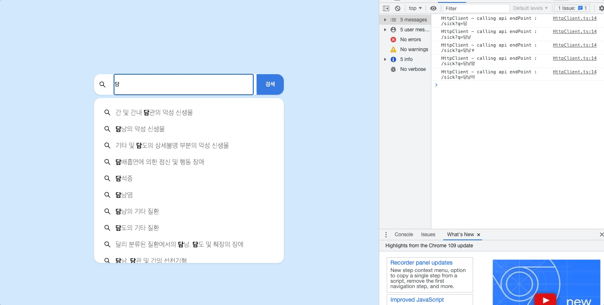

# 검색어 추천 기능이 있는 검색창
원티드 프리온보딩 인턴십에서 3주차 과제로 API 호출 최적화와 키보드 조작이 가능한 검색창을 구현했습니다.

**배포 사이트에 접속하기 전에 반드시 [API 서버](https://github.com/walking-sunset/assignment-api_8th)를 실행해 주세요**  
[🔗 배포 링크](https://recommended-search.vercel.app/)
## 목차
- [요구 사항](#1)
- [구현 내용](#2)
- [회고](#3)
- [기술 스택](#4)
- [실행 방법](#5)

## 요구 사항
* 구현 사항 
    - 질환명 검색시 API 호출 통해서 검색어 추천 기능 구현
    - 사용자가 입력한 텍스트와 일치하는 부분 볼드처리
    - 예)
        - 사용자 입력: 담낭
        추천 검색어:  **담낭**의 악성 신생물, **담낭**염, **담낭**의 기타 질환, 달리 분류된 질환에서의 **담낭**, 담도 및 췌장의 장애
    - 검색어가 없을 시 “검색어 없음” 표출
    - API 호출 최적화
        - API 호출별로 로컬 캐싱 구현
            - 캐싱 기능을 제공하는 라이브러리 사용 금지(React-Query 등)
            - 캐싱을 어떻게 기술했는지에 대한 내용 README에 기술
        - 입력마다 API 호출하지 않도록 API 호출 횟수를 줄이는 전략 수립 및 실행
            - README에 전략에 대한 설명 기술
        - API를 호출할 때 마다 `console.info("calling api")` 출력을 통해 콘솔창에서 API 호출 횟수 확인이 가능하도록 설정
    - 키보드만으로 추천 검색어들로 이동 가능하도록 구현

* 개발 조건 및 환경 
    - 언어 : JavaScript / TypeScript (가급적 선택)
    - 사용가능한 기술:
        - 전역 상태관리 라이브러리(Redux 등)
            - **단, 캐싱 기능이 포함되지 않은 것으로 제한**
        - 스타일 관련 라이브러리(styled-components, emotion, UI kit, tailwind, antd 등)
        - HTTP Client(axios 등)


## 구현 내용  <a id="2"></a>
-  CacheControl 클래스 내부에 Map 자료구조를 사용하여 쿼리 스트링을 key로 하고 검색 결과를 value로 설정하여 인메모리 캐싱 기능을 구현했습니다.  
참고 : [react-query의 QueryCache](https://github.com/TanStack/query/blob/main/packages/query-core/src/queryCache.ts)

https://github.com/hyejineee/recommended-search/blob/63e90daa16ae8b062af3d94d1de034094ad0dbf3/src/commons/utils/CacheControl.ts#L3-L33

-  키보드 이동 시 스크롤 기능까지 지원할 수 있도록 구현하기 위해 window에 keyUp 이벤트 리스너를 추가하였습니다. 키보드 이벤트가 발생할 때 focus가 input에서 추천 검색어 리스트로 이동할 수 있도록 tabIndex를 사용했습니다.

https://github.com/hyejineee/recommended-search/blob/63e90daa16ae8b062af3d94d1de034094ad0dbf3/src/components/SearchInput.tsx#L31-L45

https://github.com/hyejineee/recommended-search/blob/63e90daa16ae8b062af3d94d1de034094ad0dbf3/src/components/SearchInput.tsx#L58-L87



<br/>

## 회고 <a id="3"></a>
### 1. 의도한 결과는 무엇이었는가? (초기 목표)
- 관심사 분리와 의존성 세션에서 배운 프로젝트 구조를 적용하여 외부 데이터를 가져오는 부분과 가져온 데이터를 가공하는 부분, 화면에 보여주는 부분을 분리하는 데에 집중하여 구현했습니다.

### 2. 실제 어떤 일들이 일어났는가? (현실)
- Context API와 service 클래스를 사용하여 관심사 분리를 적적하게 이루었습니다. 다만 아쉬운 점은 키보드 입력을 핸들링 하는 부분이 하나의 컴포넌트에 모아져 있는 것이 아쉽습니다.

### 3. 지속, 개선 혹은 포기할 것들은 무엇인가? 배운 것들은 무엇인가? (목적)
- 컴포넌트로부터 데이터를 조작하는 부분과 외부 데이터를 가져오는 부분을 분리하는 프로젝트 구조에 익숙해진 것 같습니다. 구현을 하다 보니 안드로이드에서 사용했던 아키텍처와 비슷한 부분이 많다는 생각이 들었습니다. 다음 프로젝트에 적용해 보려고 합니다.

<br/>

## 기술 스택 <a id="4"></a>

    

## 실행방법 <a id="5"></a>
**프론트 서버를 실행하기 전에 API 서버가 실행되어야 합니다. 👉[API 서버 레포](https://github.com/walking-sunset/assignment-api_8th)**
1. 프로젝트를 클론합니다.
```
git clone https://github.com/hyejineee/recommended-search.git
```
2. 클론한 프로젝트 내부로 이동합니다. 
```
cd recommended-search
```
3. 의존 패키지를 설치합니다. 
```
yarn
```
4. 다음 명령어를 사용하여 서버를 실행합니다.
```
yarn dev 
```


